# TP1- TDD
## Grupo 4 Integrantes:
 - Abraham Osco 102256
 - Lucas Lazcano 107044 
 - Ricardo Luizaga 87528
 - Agustin Rodriguez 101570 

# Instrucciones
## Pre-Requisitos: 
1. Tener instalado nodeJS. 
  ``` 
sudo apt install Node.js
sudo apt install npm
  ```
## Setup para ejecutar el proyecto: 
1. Clonar el repositorio.
2. Crear un .env con la siguiente informacion: 
```
DATABASE_URL = "file:./deb.db"
``` 
3. Instalar las dependencias: 
``` 
npm install
```
4. Para correr el entorno de desarrollo:
```
npm run start:dev
```
5. La aplicación estará disponible en http://localhost:3000/.


Se puede visulizar la base de datos con Prisma Studio:
```
npx prisma studio
```

## Alternativa usando Docker
1. Clonar el repositorio.
2. Correr por única vez:
```
npm run docker-build:dev
```
Esto construirá la imagen con con todas las dependencias necesarias y la última migración de Prisma. Para construir una nueva imagen (por ejemplo, si hay una migración más nueva), volver a ejecutar el comando de construcción.
3. La aplicación estará disponible en http://localhost:3000/.

Una vez creada la imagen de Docker, se puede ejecutar el contenedor en segundo plano con:
```
npm run docker-start:dev
```
Y detener con:
```
npm run docker-stop:dev
```

# Descripción de la API
Tenemos 3 recursos principales: 
## Auth

### Register

1. **Descripción del Endpoint**:
    - **Método**: POST
    - **Ruta**: `/auth/register`
    - **Descripción**: Este endpoint se utiliza para registrar nuevos usuarios en el sistema.
2. **Parámetros de Solicitud**:
    - **Body**
    
    ```json
    {
        "email": "test@test.com",
        "password": "111222",
        "firstName": "ric",
        "lastName": "lui",
        "birthDate": "1990-05-15T12:30:00-03:00",
        "gender_id": 1
    }
    ```
    
3. **Respuestas**
    - **Código de Estado**: 200 OK

### Login

1. **Descripción del Endpoint**:
    - **Método**: POST
    - **Ruta**: `/auth/login`
    - **Descripción**: Este endpoint se utiliza para que los usuarios inicien sesión en el sistema mediante la autenticación de Basic Auth.
2. **Parámetros de la Solicitud**:
    - **Autenticación**:
        - **Tipo**: Basic Auth
        - **Nombre de usuario**: `<username>`
        - **Contraseña**: `<password>`
3. **Respuestas**:
    - **Código de Estado 200 OK**:
        - **Descripción**: Inicio de sesión exitoso.
        - **Ejemplo de Respuesta**:
            
            ```json
            {
                "accessToken": "<token>",
                "refreshToken": "<refresh_token>"
            }
            ```
            
        - **Nota**: El token de acceso (`<token>`) debe usarse en las solicitudes futuras para autorización.
    - **Código de Estado 401 Unauthorized**:
        - **Descripción**: Credenciales de inicio de sesión inválidas.

### Refresh Token

1. **Descripción del Endpoint**:
    - **Método**: GET
    - **Ruta**: `/auth/refresh`
    - **Descripción**: Este endpoint se utiliza para renovar un token de acceso expirado utilizando un token de actualización (refresh token) en el encabezado de autorización Bearer Token.
2. **Parámetros de Autorización**:
    - **Tipo**: Bearer Token
    - **Ubicación**: Encabezado `Authorization`
    - **Ejemplo**: `Authorization: Bearer <refresh_token>`
3. **Respuestas**:
    - **Código de Estado 200 OK**:
        - **Descripción**: Token de acceso renovado correctamente.
        - **Ejemplo de Respuesta**:
            
            ```json
            {
                "accessToken": "<new_access_token>",
                "refreshToken": "<refresh_token>"
            }
            ```
            
    - **Código de Estado 401 Unauthorized**:
        - **Descripción**: El token de actualización no es válido o no se proporcionó en el encabezado de autorización.

# Profiles

### Obtener todos los perfiles

1. **Descripción del Endpoint**:
    - **Método**: GET
    - **Ruta**: `/profiles`
    - **Descripción**: Este endpoint devuelve una lista de perfiles de usuarios.
2. **Parámetros de Autorización**:
    - **Tipo**: Bearer Token
    - **Ubicación**: Encabezado ****`Authorization`
    - **Ejemplo**: `Authorization: Bearer <token>`
3. **Respuestas:**
    - **Código de Estado**: 200 OK
        - **Descripción**: Solicitud exitosa, devuelve la lista de perfiles.
    - **Código de Estado 401 Unauthorized**:
        - **Descripción**: El token de actualización no es válido o no se proporcionó en el encabezado de autorización.

### Obtener el perfil de un usuario

1. **Descripción del Endpoint**:
    - **Método**: GET
    - **Ruta**: `/profiles/{email}`
    - **Descripción**: Este endpoint devuelve el perfil de un usuario identificado por el email.
2. **Parámetros de Autorización**:
    - **Tipo**: Bearer Token
    - **Ubicación**: Encabezado **`Authorization`**
    - **Ejemplo**: `Authorization: Bearer <token>`
3. **Respuestas:**
    - **Código de Estado**: 200 OK
        - **Descripción**: Solicitud exitosa, devuelve un perfil de usuario
    - **Código de Estado 401 Unauthorized**:
        - **Descripción**: El token de actualización no es válido o no se proporcionó en el encabezado de autorización.

### Obtener los seguidores de un usuario

1. **Descripción del Endpoint**:
    - **Método**: GET
    - **Ruta**: `/profiles/{email}/followers`
    - **Descripcion**: Este endpoint devuelve la lista de seguidores de un usuario específico identificado por el email.
2. **Parámetros de Autorización**:
    - **Tipo**: Bearer Token
    - **Ubicación**: Encabezado `Authorization`
    - **Ejemplo**: `Authorization: Bearer <token>`
3. **Respuestas**
    - **Código de Estado**: 200 OK
        - **Descripción**:  Solicitud exitosa, devuelve la lista de seguidores.
    - **Código de Estado 401 Unauthorized**:
        - **Descripción**: El token de actualización no es válido o no se proporcionó en el encabezado de autorización.

### Obtener los perfiles que sigue un usuario

1. **Descripción del Endpoint**:
    - **Método**: GET
    - **Ruta**: `/profiles/{email}/followed`
    - **Descripción**: Este endpoint devuelve la lista de usuarios seguidos por un usuario específico identificado por el email.
2. **Parámetros de Autorización**:
    - **Tipo**: Bearer Token
    - **Ubicación**: Encabezado `Authorization`
    - **Ejemplo**: `Authorization: Bearer <token>`
3. **Respuestas**
    - **Código de Estado**: 200 OK
        - **Descripción**: Solicitud exitosa, devuelve la lista de usuarios seguidos.
    - **Código de Estado 401 Unauthorized**:
        - **Descripción**: El token de actualización no es válido o no se proporcionó en el encabezado de autorización.

### Seguir a un perfil

1. **Descripción del Endpoint**:
    - **Método**: PUT
    - **Ruta**: `/profiles/{email}/followers`
    - **Descripción**: Este endpoint permite que el usuario siga una cuenta.
2. **Parámetros de la Solicitud**:
    - Ninguno
3. **Parámetros de Autorización**:
    - **Tipo**: Bearer Token
    - **Ubicación**: Encabezado `Authorization`
    - **Ejemplo**: `Authorization: Bearer <token>`
4. **Respuestas**:
    - **Código de Estado 200 OK**:
        - **Descripción**: La foto de perfil se actualizó correctamente.
    - **Código de Estado 401 Unauthorized**:
        - **Descripción**: El token de actualización no es válido o no se proporcionó en el encabezado de autorización
    - **Código de Estado 404 Not Found**:
        - **Descripción**: El usuario especificado no existe.

### Dejar de seguir a un perfil

1. **Descripción del Endpoint**:
    - **Método**: DELETE
    - **Ruta**: `/profiles/{email}/followers`
    - **Descripción**: Este endpoint permite que el usuario deje de seguir a una cuenta.
2. **Parámetros de la Solicitud**:
    - Ninguno
3. **Parámetros de Autorización**:
    - **Tipo**: Bearer Token
    - **Ubicación**: Encabezado `Authorization`
    - **Ejemplo**: `Authorization: Bearer <token>`
4. **Respuestas**:
    - **Código de Estado 200 OK**:
        - **Descripción**: La foto de perfil se actualizó correctamente.
    - **Código de Estado 401 Unauthorized**:
        - **Descripción**: El token de actualización no es válido o no se proporcionó en el encabezado de autorización
    - **Código de Estado 404 Not Found**:
        - **Descripción**: El usuario especificado no existe.

### Obtener la foto de perfil de un usuario

1. **Descripción del Endpoint**:
    - **Método**: GET
    - **Ruta**: `/profiles/{email}/photo`
    - **Descripción**: Este endpoint devuelve la foto de perfil de un usuario.
2. **Parámetros de Autorización**:
    - **Tipo**: Bearer Token
    - **Ubicación**: Encabezado `Authorization`
    - **Ejemplo**: `Authorization: Bearer <token>`
3. **Respuestas**:
    - **Código de Estado 200 OK**:
        - **Descripción**: Solicitud exitosa, devuelve la foto de perfil del usuario.
        - **Tipo de Contenido**: Imagen (JPG, PNG, u otro formato de imagen)
    - **Código de Estado 401 Unauthorized**:
        - **Descripción**: El token de acceso no es válido o no se proporcionó en el encabezado de autorización.
    - **Código de Estado 404 Not Found**:
        - **Descripción**: El usuario especificado no existe o no tiene una foto de perfil asociada.

## Users

### Actualizar foto de perfil de un usuario

1. **Descripción del Endpoint**:
    - **Método**: PUT
    - **Ruta**: `/users/photo`
    - **Descripción**: Este endpoint permite actualizar la foto de perfil de un usuario.
2. **Parámetros de la Solicitud**:
    - **Cuerpo de la Solicitud**:
        - **Tipo**: Formulario multipart (`multipart/form-data`)
        - **Campo**:
            - `photo` (archivo, requerido): La nueva imagen de perfil en formato blob.
3. **Parámetros de Autorización**:
    - **Tipo**: Bearer Token
    - **Ubicación**: Encabezado `Authorization`
    - **Ejemplo**: `Authorization: Bearer <token>`
4. **Respuestas**:
    - **Código de Estado 200 OK**:
        - **Descripción**: La foto de perfil se actualizó correctamente.
    - **Código de Estado 401 Unauthorized**:
        - **Descripción**: El token de actualización no es válido o no se proporcionó en el encabezado de autorización
    - **Código de Estado 404 Not Found**:
        - **Descripción**: El usuario especificado no existe.

### Obtener la foto de perfil de un usuario

1. **Descripción del Endpoint**:
    - **Método**: GET
    - **Ruta**: `/users/photo`
    - **Descripción**: Este endpoint devuelve la foto de perfil de un usuario.
2. **Parámetros de Autorización**:
    - **Tipo**: Bearer Token
    - **Ubicación**: Encabezado `Authorization`
    - **Ejemplo**: `Authorization: Bearer <token>`
3. **Respuestas**:
    - **Código de Estado 200 OK**:
        - **Descripción**: Solicitud exitosa, devuelve la foto de perfil del usuario.
        - **Tipo de Contenido**: Imagen (JPG, PNG, u otro formato de imagen)
    - **Código de Estado 401 Unauthorized**:
        - **Descripción**: El token de acceso no es válido o no se proporcionó en el encabezado de autorización.
    - **Código de Estado 404 Not Found**:
        - **Descripción**: El usuario especificado no existe o no tiene una foto de perfil asociada.

### Actualizar información básica de un usuario

1. **Descripción del Endpoint**:
    - **Método**: PATCH
    - **Ruta**: `/users`
    - **Descripción**: Este endpoint permite actualizar la información básica de un usuario.
2. **Parámetros de la Solicitud**:
    - **Cuerpo**:
    
    ```json
    {
        "email": "nuevo_email@test.com",
        "firstName": "NuevoNombre",
        "lastName": "NuevoApellido",
        "password": "nuevaContraseña",
        "birthDate": "1990-05-15T12:30:00-03:00",
        "genderId": 2
    }
    ```
    
3. **Parámetros de Autorización**:
    - **Tipo**: Bearer Token
    - **Ubicación**: Encabezado `Authorization`
    - **Ejemplo**: `Authorization: Bearer <token>`
4. **Respuestas**:
    - **Código de Estado 200 OK**:
        - **Descripción**: Información del usuario actualizada correctamente.
    - **Código de Estado 400 Bad Request**:
        - **Descripción**: Error en los datos proporcionados para la actualización.
    - **Código de Estado 401 Unauthorized**:
        - **Descripción**: El token de acceso no es válido o no se proporcionó en el encabezado de autorización.

### Obtener lista de hobbies de un usuario

1. **Descripción del Endpoint**:
    - **Método**: GET
    - **Ruta**: `/users/hobbies`
    - **Descripción**: Este endpoint devuelve la lista de hobbies de un usuario.
2. **Respuesta**:
    - **Código de Estado 200 OK**:
        - **Descripción**: Solicitud exitosa, devuelve la lista de hobbies.

### Actualizar hobbies de un usuario

1. **Descripción del Endpoint**:
    - **Método**: PUT
    - **Ruta**: `/users/hobbies`
    - **Descripción**: Este endpoint permite actualizar los hobbies de un usuario.
2. **Parámetros de la Solicitud**:
    - **Cuerpo**:
    
    ```json
    {
        "hobbies": [1, 3]
    }
    ```
    
3. **Parámetros de Autorización**:
    - **Tipo**: Bearer Token
    - **Ubicación**: Encabezado `Authorization`
    - **Ejemplo**: `Authorization: Bearer <token>`
4. **Respuestas**:
    - **Código de Estado 200 OK**:
        - **Descripción**: Hobbies del usuario actualizados correctamente.
    - **Código de Estado 400 Bad Request**:
        - **Descripción**: Error en los datos proporcionados para la actualización.
    - **Código de Estado 401 Unauthorized**:
        - **Descripción**: El token de acceso no es válido o no se proporcionó en el encabezado de autorización.

### Obtener lista de seguidores de un usuario

1. **Descripción del Endpoint**:
    - **Método**: GET
    - **Ruta**: `/users/followers`
    - **Descripción**: Este endpoint devuelve la lista de seguidores de un usuario específico.
2. **Parámetros de Autorización**:
    - **Tipo**: Bearer Token
    - **Ubicación**: Encabezado `Authorization`
    - **Ejemplo**: `Authorization: Bearer <token>`
3. **Respuestas**:
    - **Código de Estado 200 OK**:
        - **Descripción**: Solicitud exitosa, devuelve la lista de seguidores del usuario.
        - **Ejemplo de Respuesta**:
        
        ```json
        {
            "username": "aosco@fi.uba.ar",
            "followers": [
                {
                    "username": "agustin@gmail.com"
                },
                {
                    "username": "darko@gmail.com"
                }
            ]
        }
        ```
        

### Obtener lista de seguidos de un usuario

1. **Descripción del Endpoint**:
    - **Método**: GET
    - **Ruta**: `/users/followed`
    - **Descripción**: Este endpoint devuelve la lista de seguidos de un usuario específico.
2. **Parámetros de Autorización**:
    - **Tipo**: Bearer Token
    - **Ubicación**: Encabezado `Authorization`
    - **Ejemplo**: `Authorization: Bearer <token>`
3. **Respuestas**:
    - **Código de Estado 200 OK**:
        - **Descripción**: Solicitud exitosa, devuelve la lista de seguidos del usuario.
        - **Ejemplo de Respuesta**:
        
        ```json
        {
            "username": "aosco@fi.uba.ar",
            "followed": [
                {
                    "username": "agustin@gmail.com"
                }
            ]
        }
        ```
        

### Obtener el perfil de un usuario

1. **Descripción del Endpoint**:
    - **Método**: GET
    - **Ruta**: `/users/profile`
    - **Descripción**: Este endpoint devuelve el perfil de un usuario especifico.
2. **Parámetros de Autorización**:
    - **Tipo**: Bearer Token
    - **Ubicación**: Encabezado ****`Authorization`
    - **Ejemplo**: `Authorization: Bearer <token>`
3. **Respuestas:**
    - **Código de Estado**: 200 OK
        - **Descripción**: Solicitud exitosa, devuelve el perfil del usuario.
    - **Código de Estado 401 Unauthorized**:
        - **Descripción**: El token de actualización no es válido o no se proporcionó en el encabezado de autorización.

## Ejemplos: 
Se registra un nuevo usuario carames (**carames@gmail.com**): 
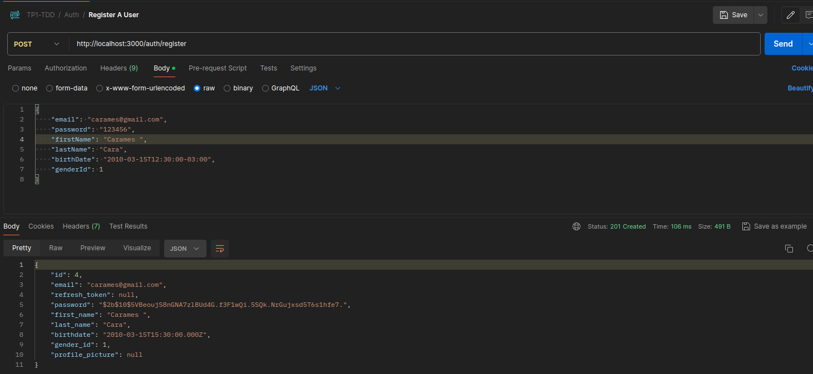
<hr>

Se logea un usuario registrado carames:
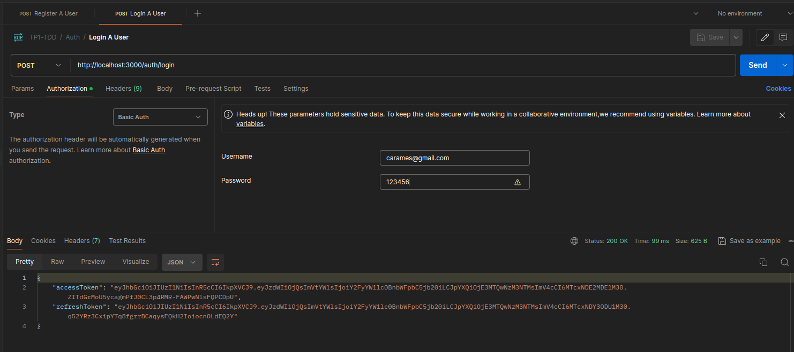
<hr>

Se asignan unos hobbies a carames:
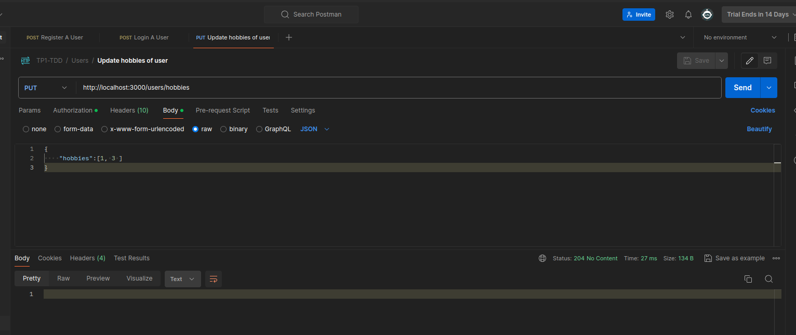
<hr>

Se obtiene los hobbies de carames: 
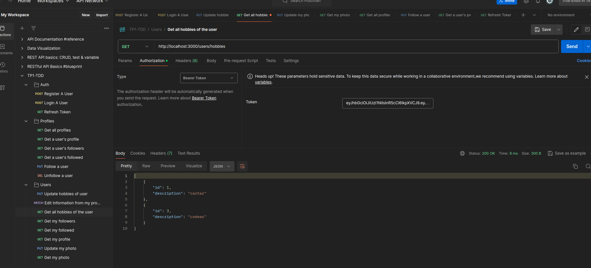
<hr>

Se obtiene los hobbies de carames: 

<hr>

Se sube la foto del usuario carames: 
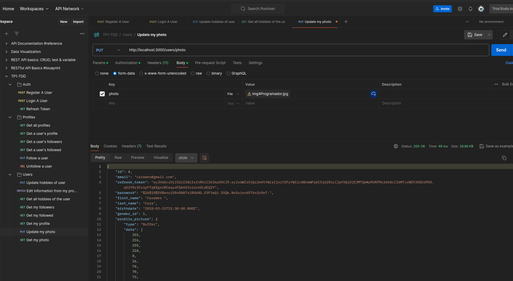
<hr>

Se obtiene la foto del usuario carames: 
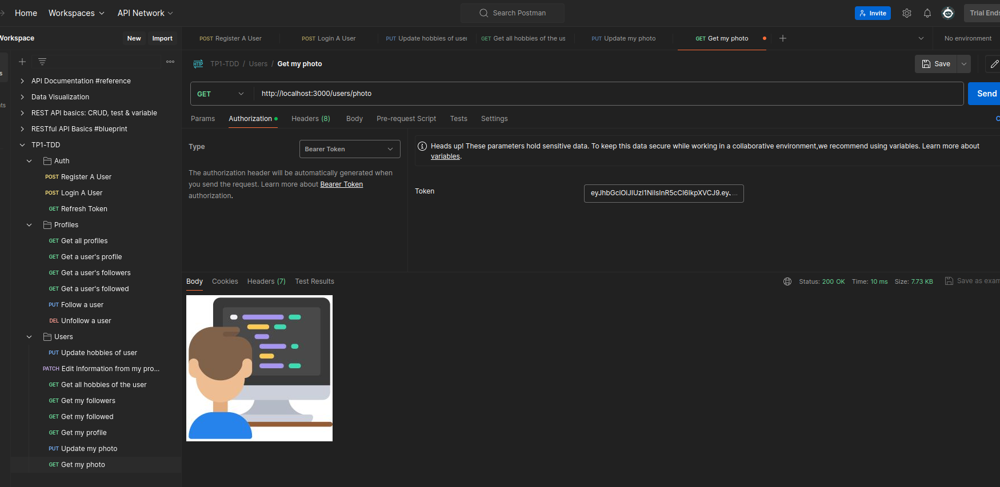
<hr>


En los seguidores del usuario aosco@gmail.com se incluye al usuario carames (Accedimos con el token JWT de carames): 
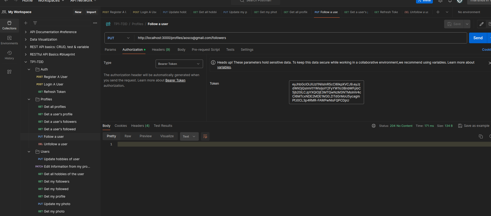
<hr>


En los seguidores del usuario aosco@gmail.com se elimina al usuario carames (Accedimos con el token JWT de carames): 
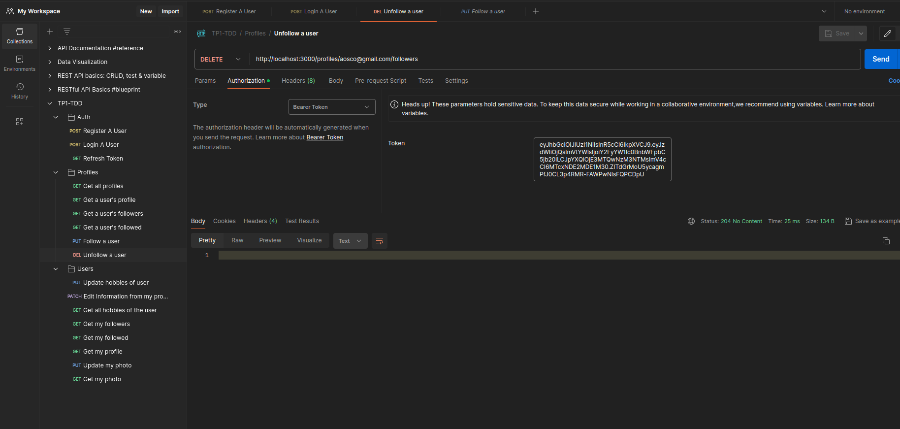
<hr>


Revaimos el perfil del usuario carames:
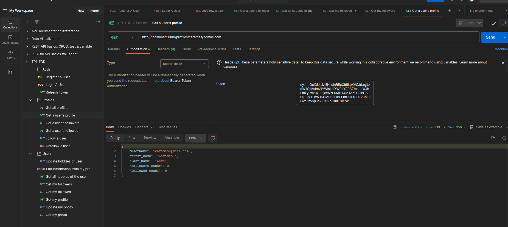
<hr>

Usando el refresh token: 
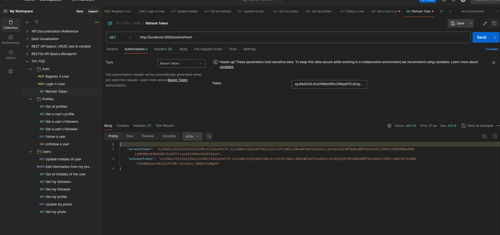
<hr>

Observando el perfil de cualquier usuario usando su username:
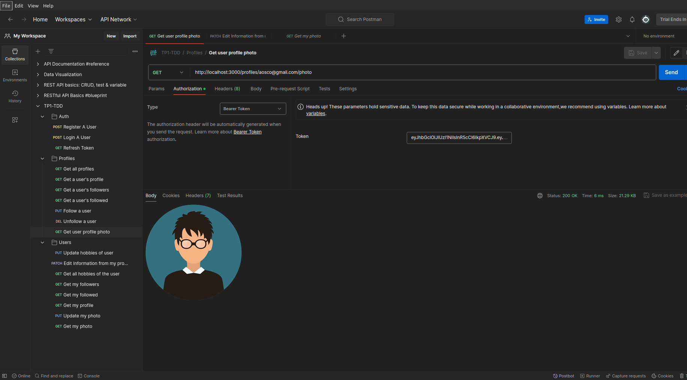
<hr>


